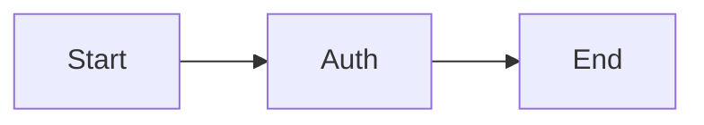

# MermaidMaker for Obsidian

> Inline GUI editor for Mermaid diagrams. Drag nodes, click `[[wikilinks]]` inside them, edit visually — all without leaving your note.

[](https://github.com/Akitaroh/mermaid-maker)
[](LICENSE)

This plugin turns Mermaid code blocks into a **visual canvas** where you can
drag nodes, add/delete/connect them, and edit labels — without switching to
an external tool. Node labels render as real Obsidian markdown, so
`[[wikilinks]]`, `#tags`, `$math$` and bold/italic all work inside the
diagram.

The world's first inline GUI Mermaid editor for Obsidian.

---

## Features

- 🖱 **Drag nodes** on a visual canvas, positions are saved as a Mermaid
  comment so the file stays portable Mermaid
- ➕ **Add / remove nodes and edges** with a toolbar button or Delete key
- ✏️ **Edit labels** by double-clicking a node
- 🔗 **`[[wikilinks]]` clickable inside nodes** — Obsidian's standard link
  click / hover preview / unresolved styling all work
- `#tags`, `$math$`, `**bold**` etc. render inside nodes
- 📐 **dagre auto-layout** for newly added nodes
- 💾 **Two-way sync**: edits write back to the Mermaid block, external
  Mermaid text edits flow back into the canvas

The plugin is **opt-in**: regular ` ```mermaid ` blocks are untouched, only
` ```mermaid-maker ` blocks are processed.

---

## Quick start



1. Add `%%editable%%` as the first line inside a ` ```mermaid-maker ` block.
2. Switch the note to **Reading view** (`cmd+e` / `ctrl+e`).
3. The diagram becomes an editable canvas. Drag, double-click, use the
   `+ ノード` button.
4. Saved automatically (500 ms debounced).

Without `%%editable%%` the block is rendered read-only with rich labels
(wikilinks etc. still work).

---

## Install

### Via BRAT (recommended for now)

The plugin is in **beta**. The fastest way to try it is via
[BRAT](https://github.com/TfTHacker/obsidian42-brat):

1. Install the BRAT plugin from Obsidian Community Plugins.
2. Open BRAT settings → **Add Beta plugin**.
3. Enter `Akitaroh/mermaid-maker` and click **Add Plugin**.
4. Enable **MermaidMaker** under Community plugins.

### Manual install

1. Download `main.js`, `manifest.json` and `styles.css` from the
   [latest release](https://github.com/Akitaroh/mermaid-maker/releases).
2. Create `<vault>/.obsidian/plugins/mermaid-maker/` and drop the three
   files in.
3. Enable in Settings → Community plugins.

### Official Community Plugin store

Submission planned for **late May 2026** after a short beta. Watch the
repo for updates.

---

## Usage notes

### Special characters in labels

If your label contains `[`, `]`, `(`, `)`, `{`, `}`, `|` or `"` (e.g.
wikilinks), use **quoted form** in your Mermaid source:

```
A["[[note]]"]  ✅
A[[[note]]]    ❌ — Mermaid parses [[..]] as subroutine shape
```

The plugin **auto-quotes** when you edit via the GUI — but if you write
markdown directly, follow this convention.

### Where positions are stored

After dragging, the plugin appends a comment line like:

```
%% mm-pos: A=10,20 B=200,30
```

This is invisible to other Mermaid renderers (it's a comment), so your
diagrams remain portable.

### Reading view vs Live Preview

GUI editing is **Reading view only**. In Live Preview (the default editor
mode), you'll see a hint `✏️ GUI 編集は読み取りビューで利用できます`.
This is intentional — Live Preview's CodeMirror widget doesn't sandbox
React mounts well.

---

## Known limitations (beta)

- Edge labels (`A -->|label| B`) display but can't be edited via GUI yet
- Node shape selector is not yet in the UI; shape is preserved from
  Mermaid source (`[box]` / `(rounded)` / `((circle))` / `(((double)))`)
- Mermaid `flowchart` variants beyond `graph LR` / `graph TD` are not
  supported
- File rename detection isn't optimal yet (resolved links update, but
  surrounding logic can lag)

---

## Architecture

Source code at
[`packages/obsidian/`](https://github.com/Akitaroh/mermaid-maker/tree/main/packages/obsidian).

Implemented with [Zettel-driven development](https://github.com/Akitaroh):

- `atoms/quote-extractor.ts` — find `"..."` labels in Mermaid source
- `atoms/markdown-renderer.ts` — Obsidian `MarkdownRenderer.render` adapter
- `atoms/label-measurer.ts` — measure rendered HTML for Mermaid layout
- `atoms/placeholder-injector.ts` — splice placeholders into Mermaid source
- `atoms/mermaid-loader.ts` — load Obsidian's bundled Mermaid
- `atoms/dagre-layout.ts` — auto layout for new nodes
- `atoms/xyflow-mounter.tsx` — React + xyflow GUI canvas mount
- `atoms/markdown-write-back.ts` — debounced safe write back to editor
- `atoms/label-edit-modal.ts` — Obsidian modal for label editing
- `arrows/mm-codeblock-render.ts` — Stage 2b: rich labels in Mermaid SVG
- `arrows/mm-editable-flow.ts` — Stage 3: full GUI editor flow

---

## Inspirations

- [Mehrmaid](https://github.com/huterguier/obsidian-mehrmaid) — pioneered
  rich-markdown labels inside Mermaid nodes inside Obsidian (read-only)
- [Excalidraw for Obsidian](https://github.com/zsviczian/obsidian-excalidraw-plugin)
  — the canonical embedded React canvas plugin pattern
- [obsidian-enhancing-mindmap](https://github.com/MarkMindCkm/obsidian-enhancing-mindmap)
  — bidirectional markdown ⇄ visual sync inside Obsidian

---

## Contributing

Issues and PRs welcome. Please open an issue first for discussion of
larger changes.

---

## License

MIT — see [LICENSE](LICENSE).
